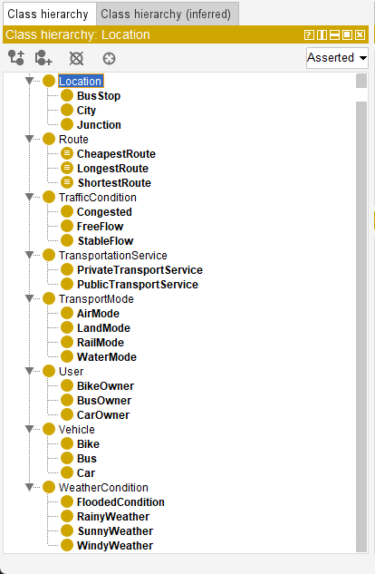
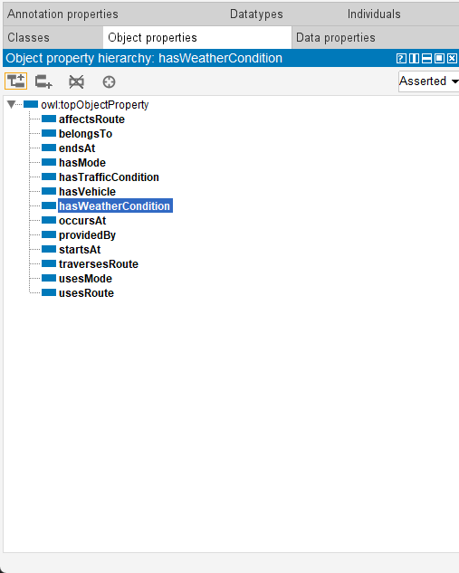
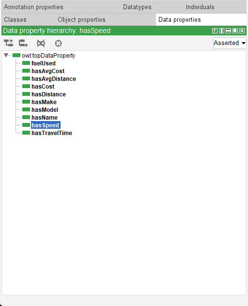
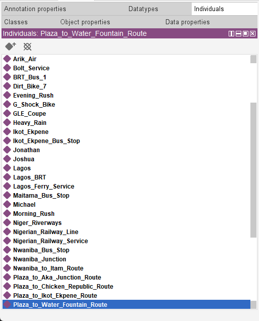
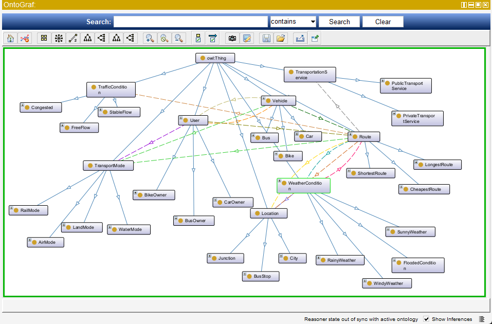

# CETRO
A Cost-Effective Transportation and Routing Ontology (CETRO) built using Protege.

# Classes in the Ontology:
1.	TransportationService: TransportationService represents any system that moves people or goods, which can be broadly categorized into services available to the public or those used privately. Public Transportation is shared and accessible to many users, while Private Transportation is restricted to individual or limited use.

2.	TransportMode: The TransportMode class represents the different methods or modes by which people or goods can move from one location to another. 

3.	Route: The Route class is necessary to model the paths or trajectories between locations, enabling the system to evaluate alternatives based on cost, distance, travel time, and external conditions such as traffic and weather.

4.	Location: The Location class is introduced to represent geographic points or areas, which are essential for defining origins, destinations, and the spatial context in which transportation activities occur.

5.	Vehicle: The Vehicle class is included to capture the means of transportation used within the system, allowing the ontology to account for variations in capacity, fuel consumption, and performance under different conditions.

6.	User: The User class is necessary to represent individuals interacting with the transportation system, enabling personalization, preference modeling, and experience-based factors such as perceived traffic conditions.

7.	TrafficCondition: The TrafficCondition class is included to model the dynamic state of road networks, as traffic congestion and flow directly influence travel time, route selection, and overall system efficiency.

8.	 WeatherCondition: The WeatherCondition class is introduced to capture atmospheric factors that impact transportation, as conditions such as rain, fog, or floods can affect route safety, vehicle performance, traffic flow, and travel time. 

# Object Properties in the Ontology:
- usesRoute (User → Route)
- hasVehicle (User → Vehicle)
- belongsTo (Vehicle → User)
- traversesRoute (Vehicle → Route)
- startsAt (Route → Location)
- endsAt (Route → Location)
- hasTrafficCondition (Route → TrafficCondition)
- hasWeatherCondition (Route → WeatherCondition)
- providedBy (Route → TransportationService)
- affectsRoute (WeatherCondition → Route)
- occursAt (WeatherCondition → Location)

# Data Properties in the Ontology:
+ hasCost (Route → xsd:float)
+ hasAvgCost (Route → xsd:float)
+ hasDistance (Route → xsd:float)
+ hasAvgDistance (Route → xsd:float)
+ hasTravelTime (Route → xsd:float)
+ fuelUsed (Vehicle → xsd:float)
+ hasSpeed (Vehicle → xsd:float)
+ hasModel (Vehicle → xsd:string)
+ hasMake (Vehicle → xsd:string)
+ hasName (User → xsd:string)

# Individuals in the Ontology:

# OntoGraf:

